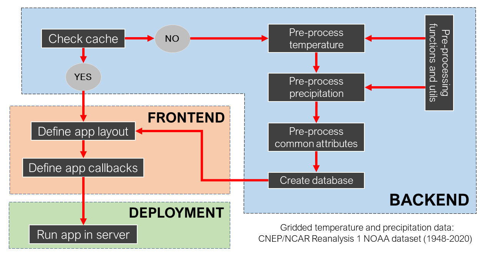

# Methods

## Back-end

## Front-end

## Deployment
The application was deployed using PythonAnywhere, an online development and web hosting service that uses Python programming language. Within PythonAnywhere webpage, it is possible to create a virtual environment using Python version 3.7 (or other version) and install all the dependencies the application requires to run. The Python Web Framework used for this app was Flask. After uploading all files (data and codes) to the website platform, the working directory was set as well as the server details through the Web Server Gateway Interface (WSGI) configuration file.

Initially, we tried to deploy the application using the cloud platform Heroku (and its command line interface), which supports many programming languages including Python, Java, Node.js, Scala and PHP. However, after performing the required steps to deploy the app and make it available online, Heroku presented an unexpected error related to memory quota consumption even though the application was not big. The source of this error was not tracked, and this solution could not be adopted for this project.
